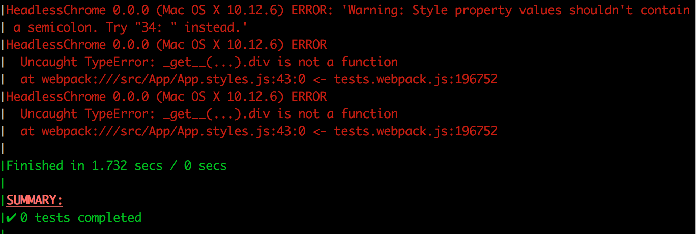

# emotion-enzyme-mock

A stack for testing React components is

- Karma - Test runner
- Mocha - Test framework
- Chai - Assertion library
- Sinon - Mock Library
- Enzyme - Test renderer for React components

When running tests in the above stack and using [emotion](https://github.com/tkh44/emotion) for CSS-in-JS, karma will fail to run, throwing errors. Presumably somewhere in the test stack, whether when using `karma-webpack`, or when enzyme renders components using `react-test-renderer`, the Emotion classes do not get generated or parsed correctly.



This mock library will mock `css` and `styled` functions from Emotion so that tests pass. This is written fairly naively using tagged template literals, but seems to work without issue.

## Installation
Using npm  
`npm i emotion-enzyme-mock -D`

Using yarn  
`yarn add emotion-enzyme-mock -D`

## Usage
emotion-enzyme-mock has a main umd bundle for usage with webpack.

### Webpack
Add `emotion` and `react-emotion` to the `noParse` key to prevent webpack from including the real libraries in the tests.
```
module: {
    noParse: [
        /node_modules\/emotion\//,
        /node_modules\/react-emotion\//
    ]
```

Then add aliases that point to this mock library in `node_modules` for `emotion` and `react-emotion` in the `resolve` config.
```
resolve: {
    alias: {
        'emotion': 'emotion-enzyme-mock',
        'react-emotion': 'emotion-enzyme-mock'
    }
}
```

This will mock the imports when loading with karma-webpack.

### Assertions
When using the `css` function, the mock returns a string (uuid) for the className. Import the style and assert its existence via a CSS selector in the enzyme assertions (example using `chai-enzyme`).
```
import Component, { container } from './Component';

...

const wrapper = mount(<Component />);
expect(wrapper)
    .to.have.exactly(1).descendants(`.${container}`);
```

When using a `styled` function, the mock returns a React component. Import the component and assert its existence directly.
```
import Component, { Title } from './Component';

...

const wrapper = moount(<Component />);
expect(wrapper)
    .to.have.exactly(1).descendants(Title);
```
This method works using Enzyme's `shallow` and `mount` methods.

When using `enzyme.render`, the component tree is rendered out to a static HTML string, so asserting the existence of a component returned from `styled` directly will fail. The mock adds a className property to the component that may be used to verify its existence.
```
import Component, { Title } from './Component';

...

const wrapper = moount(<Component />);
expect(wrapper)
    .to.have.exactly(1).descendants(Title().props.className);
```

### API
This library caches generated strings that may be tested against. Due to the nature of tagged template literals, it is necessary to specify the expected output style string in the tests.

Import the `getStyle` function to compare strings.

It is recommended to use [chai-string](http://chaijs.com/plugins/chai-string/) to compare the results with expected results to make ignoring indentation easier.

When using the `css` tag function
```
import { getStyle } from 'emotion-enzyme-mock';
import Component, { container } from './Component';

...

const expectedContainer = `
    background-color: #efefef;
    margin: 0 auto;
    max-width: 75vw;
`;
expect(getStyle(container))
    .to.equalIgnoreSpaces(expectedContainer);
```

When using the `styled` tag functions
```
import { getStyle } from 'emotion-enzyme-mock';
import Component, { Title } from './Component';

...

const expectedContainer = `
    background-color: #efefef;
    margin: 0 auto;
    max-width: 75vw;
`;
expect(getStyle(Title()))
    .to.equalIgnoreSpaces(expectedContainer);
```
**composes**  
When using `composes` to compose styles, use `.containIgnoreSpaces()` from `chai-string` because the tag function will add a new rule to the result
```
composes: 4da1319d-1ffe-422d-b94e-f918e4dda062;
```

## Future/TODOs

 - Make `getStyle` accept a component from a `styled` tag function without having to call the function, while still accepting a `css` tag function result.
 - emotion apis other than `css` and `styled` are no-ops. There may be desired tests around these.
 - Currently targeted to the specific test stack outlined above. Could be made to work with jsdom or jest.
 - Make real utilities for testing emotion with enzyme instead of naive mocks. Something along the lines of [jest-styled-components](https://github.com/styled-components/jest-styled-components)
  - Add a chai assertion plugin a la [jest-styled-components-matcher](https://www.npmjs.com/package/jest-styled-components-matcher)